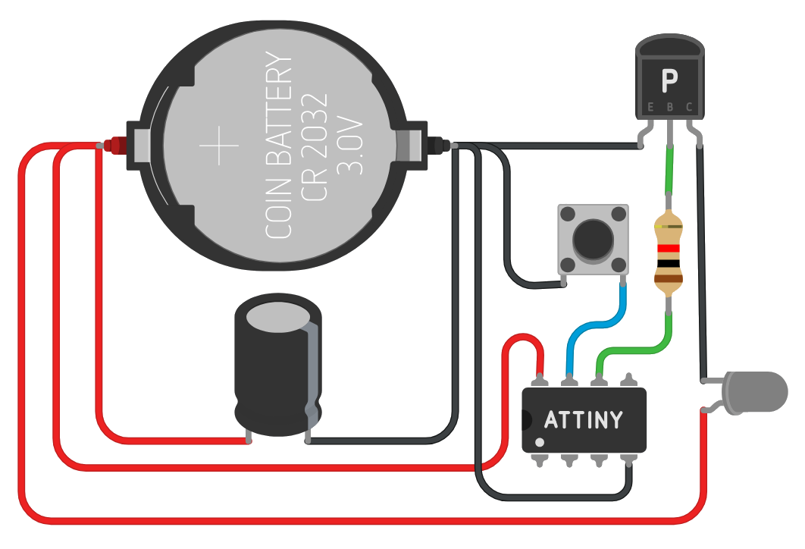

---
hide:
  - toc
---

<style>
/* ── PAGE HEADER ────────────────────────────────────────── */
.page-header {
  position: relative;
  overflow: hidden;
  border-radius: 14px;
  padding: 3.5rem 2rem 3rem;
  margin: 1.5rem 0 3rem;
  background:
    radial-gradient(ellipse at 10% 60%, rgba(0,200,255,0.10) 0%, transparent 55%),
    radial-gradient(ellipse at 90% 20%, rgba(124,58,237,0.12) 0%, transparent 55%),
    linear-gradient(135deg, #0d1117 0%, #161b22 100%);
  border: 1px solid rgba(255,255,255,0.07);
  box-shadow: 0 0 0 1px rgba(255,255,255,0.04), 0 20px 60px rgba(0,0,0,0.4);
}

.page-header::before {
  content: '';
  position: absolute;
  inset: 0;
  background-image:
    linear-gradient(rgba(0,200,255,0.03) 1px, transparent 1px),
    linear-gradient(90deg, rgba(0,200,255,0.03) 1px, transparent 1px);
  background-size: 32px 32px;
}

.page-header-inner { position: relative; z-index: 1; }

.page-header-breadcrumb {
  font-size: 0.75rem;
  font-weight: 600;
  letter-spacing: 0.15em;
  text-transform: uppercase;
  color: rgba(0,200,255,0.7);
  margin-bottom: 0.8rem;
}

.page-header h1 {
  font-size: clamp(2rem, 5vw, 3.2rem);
  font-weight: 900;
  letter-spacing: -0.03em;
  line-height: 1.05;
  margin: 0 0 0.8rem;
  background: linear-gradient(135deg, #ffffff 0%, #a0d8ef 60%, #7c3aed 100%);
  -webkit-background-clip: text;
  -webkit-text-fill-color: transparent;
  background-clip: text;
}

.page-header p {
  color: rgba(255,255,255,0.45);
  font-size: 1rem;
  margin: 0 0 1.5rem;
  max-width: 500px;
}

.header-tags { display: flex; gap: 0.5rem; flex-wrap: wrap; }

.htag {
  display: inline-flex;
  align-items: center;
  gap: 0.35rem;
  background: rgba(255,255,255,0.05);
  border: 1px solid rgba(255,255,255,0.1);
  border-radius: 6px;
  padding: 0.3rem 0.75rem;
  font-size: 0.78rem;
  font-weight: 600;
  color: rgba(255,255,255,0.55);
}

.htag.cyan {
  background: rgba(0,200,255,0.08);
  border-color: rgba(0,200,255,0.25);
  color: #00c8ff;
}

/* ── INFO BANNER ────────────────────────────────────────── */
.info-banner {
  display: flex;
  align-items: flex-start;
  gap: 1rem;
  background: rgba(0,200,255,0.06);
  border: 1px solid rgba(0,200,255,0.2);
  border-left: 3px solid #00c8ff;
  border-radius: 10px;
  padding: 1.1rem 1.4rem;
  margin: 2rem 0;
}

.info-banner .ib-icon { font-size: 1.3rem; flex-shrink: 0; margin-top: 1px; }
.info-banner .ib-title {
  font-size: 0.82rem;
  font-weight: 700;
  letter-spacing: 0.08em;
  text-transform: uppercase;
  color: #00c8ff;
  margin-bottom: 0.25rem;
}
.info-banner .ib-body {
  font-size: 0.875rem;
  color: rgba(255,255,255,0.55);
  line-height: 1.6;
  margin: 0;
}
.info-banner .ib-body strong { color: rgba(255,255,255,0.85); }

/* ── FLOW BOX ───────────────────────────────────────────── */
.flow-box {
  background: rgba(255,255,255,0.02);
  border: 1px solid rgba(255,255,255,0.07);
  border-radius: 12px;
  padding: 1.8rem 2rem;
  margin: 2rem 0;
}

.flow-box h4 {
  font-size: 0.75rem;
  font-weight: 700;
  letter-spacing: 0.12em;
  text-transform: uppercase;
  color: rgba(255,255,255,0.3);
  margin: 0 0 1.2rem;
}

.flow-list {
  display: flex;
  flex-direction: column;
  gap: 0;
  list-style: none;
  padding: 0; margin: 0;
}

.flow-list li {
  display: flex;
  align-items: flex-start;
  gap: 1rem;
  padding: 0.8rem 0;
  border-bottom: 1px solid rgba(255,255,255,0.04);
}

.flow-list li:last-child { border-bottom: none; }

.flow-num {
  width: 28px; height: 28px;
  border-radius: 8px;
  background: linear-gradient(135deg, rgba(0,200,255,0.2), rgba(124,58,237,0.2));
  border: 1px solid rgba(0,200,255,0.25);
  color: #00c8ff;
  font-size: 0.78rem;
  font-weight: 800;
  display: flex; align-items: center; justify-content: center;
  flex-shrink: 0;
}

.flow-text {
  font-size: 0.9rem;
  color: rgba(255,255,255,0.6);
  line-height: 1.5;
  padding-top: 3px;
}

.flow-text strong { color: rgba(255,255,255,0.9); }

/* ── SECTION DIVIDER ────────────────────────────────────── */
.sec-divider {
  display: flex;
  align-items: center;
  gap: 1rem;
  margin: 2.5rem 0 1.5rem;
}

.sec-divider::before, .sec-divider::after {
  content: '';
  flex: 1;
  height: 1px;
  background: rgba(255,255,255,0.07);
}

.sec-divider-label {
  font-size: 0.72rem;
  font-weight: 700;
  letter-spacing: 0.18em;
  text-transform: uppercase;
  color: rgba(255,255,255,0.25);
  white-space: nowrap;
}

/* ── CONNECTION TABLE ───────────────────────────────────── */
.conn-table {
  width: 100%;
  border-collapse: separate;
  border-spacing: 0;
  border-radius: 10px;
  overflow: hidden;
  border: 1px solid rgba(255,255,255,0.07);
  margin: 1.2rem 0;
  font-size: 0.875rem;
}

.conn-table thead tr { background: rgba(255,255,255,0.04); }

.conn-table th {
  padding: 0.7rem 1.1rem;
  text-align: left;
  font-size: 0.72rem;
  font-weight: 700;
  letter-spacing: 0.12em;
  text-transform: uppercase;
  color: rgba(255,255,255,0.3);
  border-bottom: 1px solid rgba(255,255,255,0.07);
}

.conn-table td {
  padding: 0.7rem 1.1rem;
  border-bottom: 1px solid rgba(255,255,255,0.04);
  color: rgba(255,255,255,0.6);
}

.conn-table tr:last-child td { border-bottom: none; }
.conn-table tr:hover td { background: rgba(255,255,255,0.02); }

.conn-table code {
  background: rgba(0,200,255,0.1);
  border: 1px solid rgba(0,200,255,0.2);
  color: #00c8ff;
  padding: 0.15rem 0.5rem;
  border-radius: 5px;
  font-size: 0.82rem;
}

/* ── WARNING / TIP BANNERS ──────────────────────────────── */
.wb {
  display: flex;
  align-items: flex-start;
  gap: 0.9rem;
  border-radius: 10px;
  padding: 1rem 1.3rem;
  margin: 1.2rem 0;
  font-size: 0.875rem;
}

.wb.warn   { background: rgba(255,170,0,0.07);  border: 1px solid rgba(255,170,0,0.2);  border-left: 3px solid #ffaa00; }
.wb.tip    { background: rgba(0,200,100,0.07);  border: 1px solid rgba(0,200,100,0.2);  border-left: 3px solid #00c864; }
.wb.danger { background: rgba(255,60,60,0.07);  border: 1px solid rgba(255,60,60,0.2);  border-left: 3px solid #ff3c3c; }
.wb.note   { background: rgba(124,58,237,0.07); border: 1px solid rgba(124,58,237,0.2); border-left: 3px solid #7c3aed; }

.wb-icon { font-size: 1.1rem; flex-shrink: 0; margin-top: 1px; }

.wb-inner .wb-title {
  font-size: 0.75rem;
  font-weight: 700;
  letter-spacing: 0.1em;
  text-transform: uppercase;
  margin-bottom: 0.2rem;
}

.wb.warn   .wb-title { color: #ffaa00; }
.wb.tip    .wb-title { color: #00c864; }
.wb.danger .wb-title { color: #ff3c3c; }
.wb.note   .wb-title { color: #a78bfa; }

.wb-inner p {
  color: rgba(255,255,255,0.55);
  margin: 0;
  line-height: 1.5;
}

.wb-inner p strong { color: rgba(255,255,255,0.85); }

/* ── PINOUT BOX ─────────────────────────────────────────── */
.pinout-box {
  background: #0d1117;
  border: 1px solid rgba(0,200,255,0.15);
  border-radius: 10px;
  padding: 1.4rem 1.6rem;
  margin: 1.2rem 0;
  font-family: 'JetBrains Mono', 'Fira Code', monospace;
  font-size: 0.82rem;
  line-height: 1.9;
  color: rgba(255,255,255,0.6);
  overflow-x: auto;
  white-space: pre;
}

/* ── IDE TABLE ──────────────────────────────────────────── */
.ide-table {
  width: 100%;
  border-collapse: separate;
  border-spacing: 0 4px;
  margin: 1.2rem 0;
  font-size: 0.875rem;
}

.ide-table td { padding: 0.6rem 1rem; color: rgba(255,255,255,0.6); }

.ide-table td:first-child {
  background: rgba(255,255,255,0.03);
  border-radius: 6px 0 0 6px;
  font-weight: 700;
  color: rgba(255,255,255,0.35);
  font-size: 0.78rem;
  letter-spacing: 0.05em;
  text-transform: uppercase;
  width: 140px;
}

.ide-table td:last-child {
  background: rgba(255,255,255,0.03);
  border-radius: 0 6px 6px 0;
}

.ide-table code {
  background: rgba(0,200,255,0.1);
  border: 1px solid rgba(0,200,255,0.2);
  color: #00c8ff;
  padding: 0.15rem 0.5rem;
  border-radius: 5px;
  font-size: 0.82rem;
}

/* ── ASSIGN TABLE ───────────────────────────────────────── */
.assign-table {
  width: 100%;
  border-collapse: separate;
  border-spacing: 0;
  border-radius: 10px;
  overflow: hidden;
  border: 1px solid rgba(255,255,255,0.07);
  font-size: 0.875rem;
}

.assign-table thead tr { background: rgba(255,255,255,0.04); }

.assign-table th {
  padding: 0.75rem 1.2rem;
  text-align: left;
  font-size: 0.72rem;
  font-weight: 700;
  letter-spacing: 0.12em;
  text-transform: uppercase;
  color: rgba(255,255,255,0.3);
  border-bottom: 1px solid rgba(255,255,255,0.07);
}

.assign-table td {
  padding: 0.8rem 1.2rem;
  border-bottom: 1px solid rgba(255,255,255,0.04);
  color: rgba(255,255,255,0.6);
}

.assign-table tr:last-child td { border-bottom: none; }
.assign-table tr:hover td { background: rgba(255,255,255,0.02); }
.assign-table .pname { font-weight: 700; color: rgba(255,255,255,0.85); }

.assign-table code {
  background: rgba(124,58,237,0.12);
  border: 1px solid rgba(124,58,237,0.25);
  color: #a78bfa;
  padding: 0.15rem 0.5rem;
  border-radius: 5px;
  font-size: 0.82rem;
}

.hex-badge {
  display: inline-block;
  background: linear-gradient(135deg, rgba(0,200,255,0.15), rgba(124,58,237,0.15));
  border: 1px solid rgba(0,200,255,0.25);
  color: #00c8ff;
  border-radius: 6px;
  padding: 0.15rem 0.6rem;
  font-family: monospace;
  font-size: 0.85rem;
  font-weight: 700;
}

.add-row td { color: rgba(255,255,255,0.2) !important; font-style: italic; }

/* ── OUTPUT BOX ─────────────────────────────────────────── */
.output-box {
  background: #0a0d11;
  border: 1px solid rgba(0,200,100,0.2);
  border-left: 3px solid #00c864;
  border-radius: 10px;
  padding: 1.2rem 1.5rem;
  margin: 1rem 0;
  font-family: 'JetBrains Mono', 'Fira Code', monospace;
  font-size: 0.82rem;
  line-height: 1.9;
}

.output-box .out-header {
  font-size: 0.72rem;
  font-weight: 700;
  letter-spacing: 0.12em;
  text-transform: uppercase;
  color: #00c864;
  margin-bottom: 0.6rem;
}

.out-line { color: rgba(255,255,255,0.45); }
.out-ok   { color: #00c864; }
.out-val  { color: #00c8ff; }
</style>


<!-- ╔══════════════════════════════════════╗ -->
<!-- ║           PAGE HEADER               ║ -->
<!-- ╚══════════════════════════════════════╝ -->

<div class="page-header">
  <div class="page-header-inner">
    <div class="page-header-breadcrumb">DealerBot → Hardware</div>
    <h1>Telecomandi</h1>
    <p>Sistema di controllo infrarossi — Protocollo NEC su ATtiny85</p>
    <div class="header-tags">
      <span class="htag cyan">NEC 38kHz</span>
      <span class="htag cyan">ATtiny85</span>
      <span class="htag">Arduino ISP</span>
      <span class="htag">IRremote v4.x</span>
      <span class="htag">C++ / Arduino</span>
    </div>
  </div>
</div>

<div class="info-banner">
  <div class="ib-icon">!</div>
  <div>
    <div class="ib-title">Panoramica del Sistema</div>
    <p class="ib-body">Il sistema <strong>DealerBot</strong> utilizza telecomandi IR <i>(protocollo NEC)</i> per identificare ogni giocatore e attivare la distribuzione automatica delle carte.</p>
  </div>
</div>

---

## Architettura del Sistema




<div class="sec-divider"><span class="sec-divider-label">Pinout ATtiny85</span></div>
 <div class="pinout-box"><span style="color:rgba(255,255,255,0.3)">                                                    
           ┌──────┐</span>
<span style="color:#888">PB5 (RST)</span> ─┤1    8├─ <span style="color:#ff9f43">VCC  (5V/3.3V)</span>
<span style="color:#555">PB3      </span> ─┤2    7├─ <span style="color:#888">PB2  (SCK)</span>
<span style="color:#555">PB4      </span> ─┤3    6├─ <span style="color:#00c8ff">PB1  ← LED IR   (Pin 1)</span>
<span style="color:#888">GND      </span> ─┤4    5├─ <span style="color:#a78bfa">PB0  ← BUTTON   (Pin 2)</span> <span style="color:rgba(255,255,255,0.3)">
           └──────┘</span></div>

---

## Logica di Funzionamento

<div class="flow-box">
  <h4>Flusso Operativo</h4>
  <ul class="flow-list">
    <li>
      <div class="flow-num">1</div>
      <div class="flow-text">Il giocatore preme il <strong>pulsante</strong> sul telecomando</div>
    </li>
    <li>
      <div class="flow-num">2</div>
      <div class="flow-text">L'<strong>ATtiny85</strong> invia un codice IR univoco via LED IR</div>
    </li>
    <li>
      <div class="flow-num">3</div>
      <div class="flow-text">Il <strong>ricevitore centrale</strong> decodifica il segnale NEC</div>
    </li>
    <li>
      <div class="flow-num">4</div>
      <div class="flow-text">Viene assegnata la <strong>carta corrispondente</strong> al giocatore</div>
    </li>
  </ul>
</div>

---

## Firmware e Programmazione

=== "Arduino ISP"

    <div class="sec-divider"><span class="sec-divider-label">Setup programmatore</span></div>

    **Step 1 — Prepara l'Arduino UNO come programmatore:**

    - Collega **Arduino UNO** al PC via USB
    - Carica lo sketch **ArduinoISP** *(File → Esempi → ArduinoISP)*
    - Vai in *Strumenti → Programmatore* → seleziona **Arduino as ISP**

    <div class="sec-divider"><span class="sec-divider-label">Schema di collegamento Arduino UNO ↔ ATtiny85</span></div>

    <table class="conn-table">
      <thead><tr><th>Arduino UNO</th><th>ATtiny85</th><th>Descrizione</th></tr></thead>
      <tbody>
        <tr><td><code>5V</code></td><td><code>VCC</code></td><td>Alimentazione</td></tr>
        <tr><td><code>GND</code></td><td><code>GND</code></td><td>Massa</td></tr>
        <tr><td><code>Pin 10</code></td><td><code>RESET</code></td><td>Reset programmatore</td></tr>
        <tr><td><code>Pin 11</code></td><td><code>MOSI</code></td><td>Dati verso chip</td></tr>
        <tr><td><code>Pin 12</code></td><td><code>MISO</code></td><td>Dati dal chip</td></tr>
        <tr><td><code>Pin 13</code></td><td><code>SCK</code></td><td>Clock SPI</td></tr>
      </tbody>
    </table>

    <div class="wb warn">
      <div class="wb-icon">⚠️</div>
      <div class="wb-inner">
        <div class="wb-title">Condensatore anti-reset</div>
        <p>Aggiungi un <strong>condensatore da 10µF</strong> tra <code>RESET</code> e <code>GND</code> di Arduino UNO per evitare il reset automatico durante la programmazione.</p>
      </div>
    </div>

    <div class="sec-divider"><span class="sec-divider-label">Configurazione IDE</span></div>

    Vai in *Strumenti* e configura i seguenti parametri:

    <table class="ide-table">
      <tr><td>Scheda</td><td><code>ATtiny85</code></td></tr>
      <tr><td>Clock</td><td><code>Internal 8 MHz</code></td></tr>
      <tr><td>Programmer</td><td><code>Arduino as ISP</code></td></tr>
    </table>


    <div class="wb tip">
      <div class="wb-icon">!</div>
      <div class="wb-inner">
        <div class="wb-title">Importante</div>
        <p>Clicca su <strong><em>Strumenti → Burn Bootloader</strong></em> per impostare i fuses,
    e infine <em><strong>Sketch → Carica con Programmatore</em></strong>.</p>
      </div>
    </div>

    Ora puoi passare alla prossima scheda: <strong><em>Trasmettitore (ATtiny85)</em></strong>

=== "Trasmettitore (ATtiny85)"

    <div class="sec-divider"><span class="sec-divider-label">Funzione</span></div>

    Invia segnali IR per identificare univocamente il giocatore che preme il tasto.

    <div class="wb warn">
      <div class="wb-icon">⚠️</div>
      <div class="wb-inner">
        <div class="wb-title">Attenzione — Codici Univoci</div>
        <p>Ogni telecomando <strong>deve</strong> avere un codice <code>HEX</code> diverso nel parametro <code>command</code>. Usa la tabella di assegnazione per assegnare correttamente i codici.</p>
      </div>
    </div>

    <div class="sec-divider"><span class="sec-divider-label">Codice sorgente</span></div>

    ```cpp
    #include <Arduino.h>
    #include <TinyIRSender.hpp>

    #define IR_PIN      1   // PB1 — LED IR (con resistenza da 100Ω)
    #define BUTTON_PIN  2   // PB2 — Pulsante (INPUT_PULLUP)

    // ┌───────────────────────────────────────┐
    // │  TABELLA ASSEGNAZIONE GIOCATORI       │
    // │                                       │
    // │  Giocatore 1 → 0x0C                   │
    // │  Giocatore 2 → 0x18                   │
    // │  Giocatore 3 → 0x5E                   │
    // │  Giocatore 4 → 0x08                   │
    // │  Giocatore 5 → 0x1C                   │
    // │  Giocatore 6 → 0x5A                   │
    // │  Giocatore 7 → 0x42                   │
    // └───────────────────────────────────────┘

    void setup() {
        pinMode(BUTTON_PIN, INPUT_PULLUP);
    }

    void loop() {
        if (digitalRead(BUTTON_PIN) == LOW) {
            sendNEC(1, 0x0, 0x0C, 0);   // ← modifica 0x0C per ogni giocatore
            delay(500);          
        }
    }
    ```

    <div class="wb note">
      <div class="wb-icon">📦</div>
      <div class="wb-inner">
        <div class="wb-title">Libreria richiesta</div>
        <p>Installa <strong>IRremote</strong> (v4.x) o <strong>TinyIRSender</strong> dal Library Manager dell'IDE.</p>
      </div>
    </div>

=== "Debugger (Ricevitore)"

    <div class="sec-divider"><span class="sec-divider-label">Scopo</span></div>

    Verifica i codici IR ricevuti durante lo sviluppo e il testing dei telecomandi.

    <div class="wb tip">
      <div class="wb-icon">💡</div>
      <div class="wb-inner">
        <div class="wb-title">Quando usarlo</div>
        <p>Usa questo sketch su un <strong>Arduino UNO</strong> collegato al PC per leggere i codici di ogni telecomando prima di integrarli nel firmware principale.</p>
      </div>
    </div>

    <div class="sec-divider"><span class="sec-divider-label">Pinout ricevitore IR</span></div>

    <div class="pinout-box"><span style="color:rgba(255,255,255,0.35)">Modulo IR (es. VS1838B / TSOP4838)</span>
    │
    ├── <span style="color:#ff9f43">VCC</span>  → <span style="color:#ff9f43">5V</span>
    ├── <span style="color:#888">GND</span>  → <span style="color:#888">GND</span>
    └── <span style="color:#00c8ff">OUT</span>  → <span style="color:#a78bfa">Pin 11</span> (Arduino)</div>

    <div class="sec-divider"><span class="sec-divider-label">Codice sorgente</span></div>

    ```cpp
    #include <IRremote.hpp>

    #define IR_RECEIVE_PIN  11    // Pin dati del modulo VS1838B / TSOP4838

    void setup() {
        Serial.begin(9600);
        IrReceiver.begin(IR_RECEIVE_PIN, ENABLE_LED_FEEDBACK);
        Serial.println("=== DealerBot IR Debugger ===");
        Serial.println("In attesa di segnali IR...");
    }

    void loop() {
        if (IrReceiver.decode()) {
            Serial.print("[ OK ]  Codice ricevuto: 0x");
            Serial.print(IrReceiver.decodedIRData.decodedRawData, HEX);
            Serial.print("  |  Protocollo: ");
            Serial.println(IrReceiver.decodedIRData.protocol);
            IrReceiver.resume();
        }
    }
    ```

    <div class="output-box">
      <div class="out-header">Output atteso — Serial Monitor</div>
      <div class="out-line">=== DealerBot IR Debugger ===</div>
      <div class="out-line">In attesa di segnali IR...</div>
      <div><span class="out-ok">[ OK ]</span>  Codice ricevuto: <span class="out-val">0xC</span>   |  Protocollo: <span class="out-val">NEC</span></div>
      <div><span class="out-ok">[ OK ]</span>  Codice ricevuto: <span class="out-val">0x18</span>  |  Protocollo: <span class="out-val">NEC</span></div>
    </div>

---

## Tabella Assegnazione Codici

<table class="assign-table">
  <thead>
    <tr>
      <th>Giocatore</th>
      <th>Codice HEX</th>
      <th>Chiamata Funzione</th>
    </tr>
  </thead>
  <tbody>
    <tr>
      <td class="pname">Giocatore 1</td>
      <td><code>F30CFF00</code></td>
      <td><span class="hex-badge">sendNEC(1, 0x0, 0xC, 0);</span></td>
    </tr>
    <tr>
      <td class="pname">Giocatore 2</td>
      <td><code>E718FF00</code></td>
      <td><span class="hex-badge">sendNEC(1, 0x0, 0x18, 0);</span></td>
    </tr>
    <tr>
      <td class="pname">Giocatore 3</td>
      <td><code>A15EFF00</code></td>
      <td><span class="hex-badge">sendNEC(1, 0x0, 0x5E, 0);</span></td>
    </tr>
    <tr>
      <td class="pname">Giocatore 4</td>
      <td><code>F708FF00</code></td>
      <td><span class="hex-badge">sendNEC(1, 0x0, 0x8, 0);</span></td>
    </tr>
    <tr>
      <td class="pname">Giocatore 5</td>
      <td><code>E31CFF00</code></td>
      <td><span class="hex-badge">sendNEC(1, 0x0, 0x1C, 0);</span></td>
    </tr>
    <tr>
      <td class="pname">Giocatore 6</td>
      <td><code>A55AFF00</code></td>
      <td><span class="hex-badge">sendNEC(1, 0x0, 0x5A, 0);</span></td>
    </tr>
    <tr>
      <td class="pname">Giocatore 7</td>
      <td><code>BD42FF00</code></td>
      <td><span class="hex-badge">sendNEC(1, 0x0, 0x42, 0);</span></td>
    </tr>
  </tbody>
</table>
